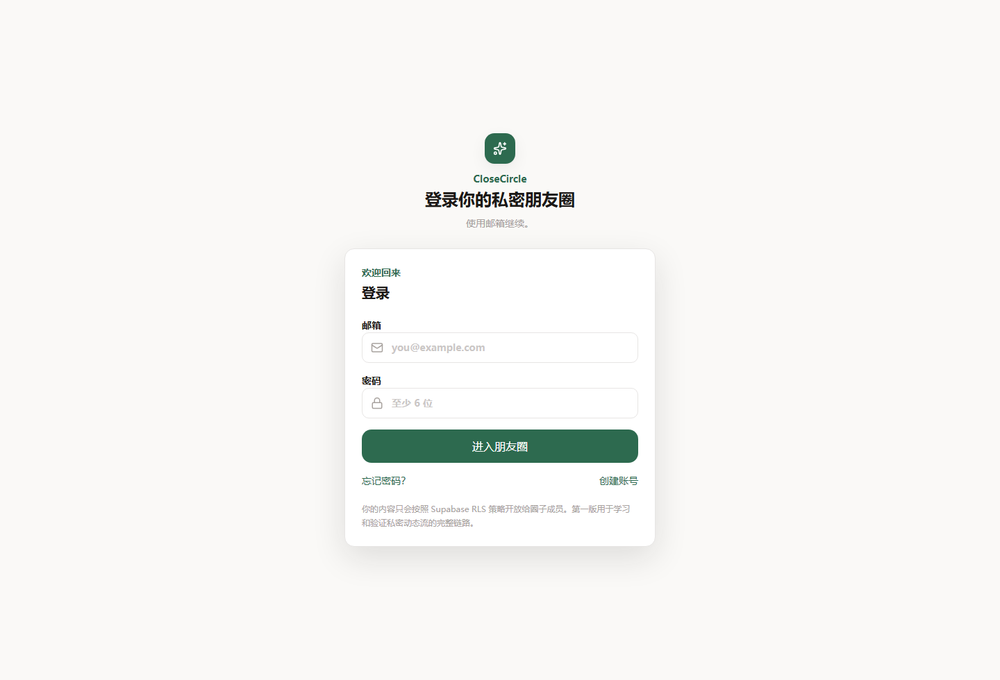
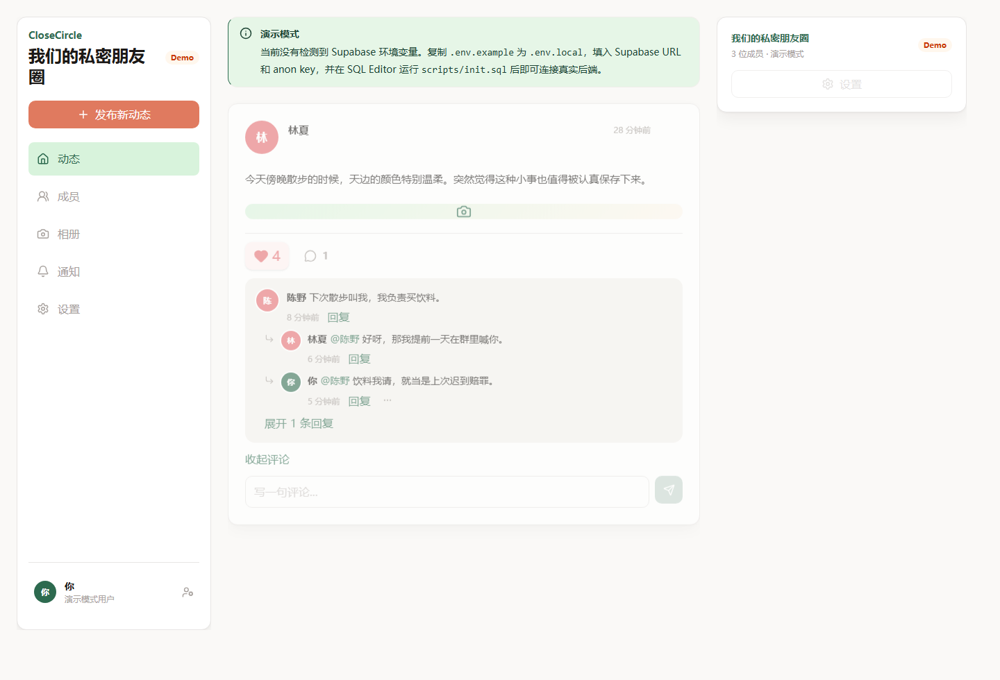
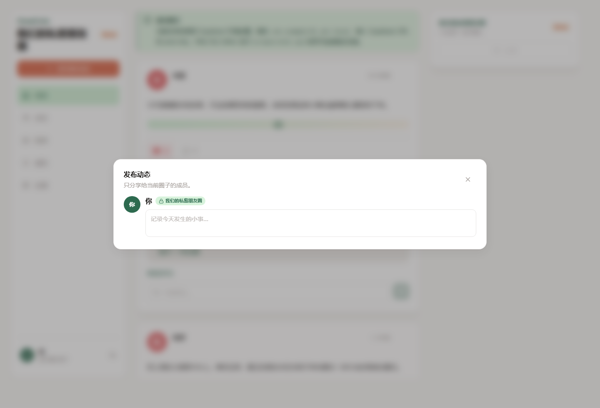
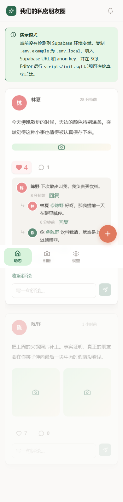

# CloseCircle 私密朋友圈

CloseCircle 是一个移动端优先的私密朋友动态墙，用来保存小圈子里的照片、近况、评论和互动。它没有公开推荐流，也不追求复杂指标，核心目标是让几十位真实朋友能在一个只属于他们的小圈子里同步日常。

项目同时保留了 Supabase 的完整接入路径：没有配置环境变量时会进入演示模式，方便先查看界面和交互；连接 Supabase 后则使用真实的 Auth、Postgres、Storage、RLS 和 Realtime。

## 应用截图

### 邮箱登录



### 桌面端动态流



### 发布动态弹层



### 移动端首页



## 主要功能

- 邮箱登录、注册提示和密码重置入口。
- 首次登录自动创建默认私密圈子。
- 发布文字和图片动态，图片上传前会校验类型与大小。
- 动态流支持分页、搜索、置顶、评论、回复和点赞。
- 通知中心支持未读状态、去重和一键已读。
- 相册、邀请成员、圈子设置、个人资料设置等基础闭环。
- 图片预览使用私有 Storage 签名 URL，并在前端释放本地预览资源。
- 缺少 Supabase 配置时自动进入演示模式，便于离线体验 UI。

## 技术栈

| 层级 | 技术 |
| --- | --- |
| 前端 | React 19、TypeScript 6、Vite 8 |
| 样式 | Tailwind CSS 4、CSS Variables |
| 状态 | TanStack Query v5 |
| 后端 | Supabase Auth、Postgres、Storage、Realtime |
| 图标 | lucide-react |
| 测试 | Vitest、React Testing Library、Playwright |

## 本地运行

```bash
npm install
npm run dev
```

打开 Vite 输出的本地地址即可。如果没有 `.env.local`，应用会显示“演示模式”提示，并使用 `src/data/demo.ts` 中的本地数据。

常用命令：

```bash
npm run lint
npm run test
npm run e2e
npm run build
npm run preview
```

## 连接 Supabase

1. 在 Supabase Dashboard 创建项目。
2. 打开 SQL Editor，新建查询。
3. 粘贴并运行 `scripts/init.sql`。
4. 复制 `.env.example` 为 `.env.local`。
5. 填入项目 URL 和 anon key。

```bash
VITE_SUPABASE_URL=https://your-project.supabase.co
VITE_SUPABASE_ANON_KEY=your-anon-key
```

6. 重启本地 dev server。

当前登录方式只保留邮箱登录。Supabase Dashboard 中建议开启 Email provider，并根据需要配置邮件模板和站点 URL；Google、GitHub、手机号登录入口已从前端移除。

## 数据库与存储

`scripts/init.sql` 会初始化完整后端：

- 表：`profiles`、`circles`、`circle_members`、`posts`、`post_images`、`comments`、`reactions`、`circle_invites`、`notifications`
- RPC：`create_default_circle`、`get_feed_posts`、`search_circle_posts`、`create_circle_invite`、`accept_circle_invite`、`revoke_circle_invite`、`remove_circle_member`、`mark_notification_read`、`mark_all_notifications_read`
- RLS：所有业务表都启用行级安全，私密圈访问权限由数据库兜底。
- Storage：`post-media` 和 `avatars` 都是私有 bucket，通过签名 URL 读取图片。
- Realtime：对动态、评论、点赞和通知变更做查询失效与同步刷新。

如果已经部署过旧版 SQL，可以查看 `scripts/migrations/` 下的增量迁移，或直接在开发环境重新运行最新的 `scripts/init.sql`。

## 部署

项目构建结果是静态文件：

```bash
npm run build
```

构建产物位于 `dist/`，可以部署到 Vercel、Netlify、Cloudflare Pages、GitHub Pages 等静态托管平台。部署时记得在平台的环境变量中配置：

- `VITE_SUPABASE_URL`
- `VITE_SUPABASE_ANON_KEY`

Supabase Auth 的 Site URL 和 Redirect URLs 也需要同步填写线上域名，否则邮件确认、密码重置等跳转可能回不到正式站点。

## 更新 README 截图

README 中的截图由 Playwright 在演示模式下生成：

```bash
node scripts/capture-readme-screenshots.mjs
```

生成文件位于 `docs/images/`。如果 UI 有明显变化，重新运行该脚本即可刷新截图。

## 常见问题

如果首次登录后创建圈子时报 `new row violates row-level security policy for table "circles"`，请在 Supabase SQL Editor 重新运行最新的 `scripts/init.sql`。当前版本通过 `create_default_circle()` 在数据库侧原子创建默认圈子和 owner 成员关系，避免首次登录时的 RLS 竞态。

如果动态流报 `Could not embed because more than one relationship was found`，请确认前端已是最新版本并重启 Vite。当前查询使用了明确的 Supabase 关系提示，例如 `profiles!posts_author_id_fkey`。
